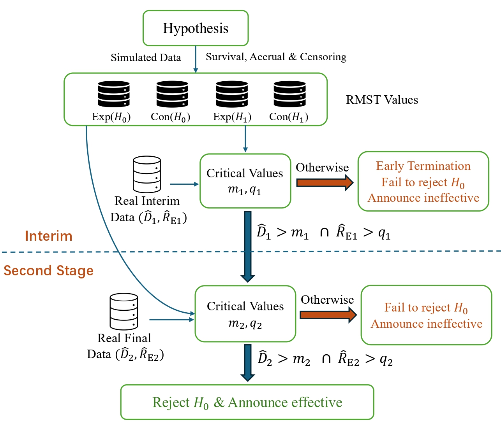

# ScuRMST

[](https://github.com/garcia-ho/ScuRMST/releases)
[](https://github.com/garcia-ho/ScuRMST/issues)
[](https://github.com/garcia-ho/ScuRMST/blob/master/LICENSE)

## Overview

### Flow Chart of Sculpted RMST design
 

`ScuRMST` package is used for for Sculpted RMST Two Stages Double-arm Clinical Trial Design.  

Sculpted refers to a defined critical region that necessitates both a significant difference in RMST between groups and a large absolute value of RMST in the experimental group in order to declare the treatment effective.  
Further information of technical details can be found at [GitHub repository](https://github.com/garcia-ho/RMST_Code.git)

## Installation

You can install the development version of `ScuRMST` from GitHub with:

```r
# Install devtools if you haven't already
install.packages("devtools")

# Install ScuRMST from GitHub
devtools::install_github("garcia-ho/ScuRMST")
```

Due to the computational burdensome of simulation, many functions in this package are based on parallel computing using package [Foreach](https://www.rdocumentation.org/packages/foreach/versions/1.5.2) and package [doParallel](https://www.rdocumentation.org/packages/doParallel/versions/1.0.17).  
Please register the number of cores first after importing `ScuRMST`:    

```r
# Set the number of cores as needed
set_cores(8)  

# Return the current number of cores
get_cores

# Return the number of cores that available in your machine
n_cores <- detectCores()
```

## Features & Examples

### Given Total sample size N and interim sample size n

Example 1: Searching for the most powerful design (critical values) of Sculpted RMST under $\alpha \leq 0.05$:  

```r
 sim_size <- 5000 
 N <- 100
 r <- 60
 acc_time <- N / r
 cen_time <- 1
 lambda_H1 <- 0.9
 HR <- 1.7
 lambda_H0 <- 0.9 * 1.7
 change_time <- 1
 interim <- 0.6 * acc_time
 n <- ceiling(N / 2)
 alpha <- 0.05
 tau_f <- 2.5
 
 # Generate data for control arm (C) and experimental arm (E) under H0 and H1
 data_C <- expo_gen_2stages(N = n * sim_size, acc_time = acc_time, 
                            lambda = lambda_H0, dist = 'exp', 
                            cen_time = cen_time, arm = 0, interim = interim)
 data_E_H0 <- expo_gen_2stages(N = n * sim_size, acc_time = acc_time, 
                            lambda = lambda_H0, dist = 'exp',
                            cen_time = cen_time, arm = 1, interim = interim)
 data_E_H1 <- expo_gen_2stages(N = n * sim_size, acc_time = acc_time, 
                            lambda = lambda_H1, dist = 'exp', 
                            cen_time = cen_time, arm = 1, interim = interim)

 # Calculate RMST data for interim and final stages under H0 and H1
 rmst_h0_int <- RMST_sim_cal(n = n, data_E = data_E_H0[ , c(2,3,1)], 
                data_C = data_C[ , c(2,3,1)], tau = interim, sim_size = sim_size)
 rmst_h0_fin <- RMST_sim_cal(n = n, data_E = data_E_H0[ , c(4,5,1)], 
                data_C = data_C[ , c(4,5,1)], tau = tau_f, sim_size = sim_size)
 rmst_h1_int <- RMST_sim_cal(n = n, data_E = data_E_H1[ , c(2,3,1)], 
                data_C = data_C[ , c(2,3,1)], tau = interim, sim_size = sim_size)
 rmst_h1_fin <- RMST_sim_cal(n = n, data_E = data_E_H1[ , c(4,5,1)], 
                data_C = data_C[ , c(4,5,1)], tau = tau_f, sim_size = sim_size)
 # Combine RMST data
 rmst_data <- rbind(rmst_h0_int, rmst_h1_int, rmst_h0_fin, rmst_h1_fin)

 # Calculate variance-covariance matrices under H0 and H1
 mu_cov_h0 <- mu_cov_mc(rmst_int = rmst_h0_int, rmst_fin = rmst_h0_fin, sim_size = sim_size)
 mu_cov_h1 <- mu_cov_mc(rmst_int = rmst_h1_int, rmst_fin = rmst_h1_fin, sim_size = sim_size)

 # Perform adaptive grid search for the best RMST design
 best_RMST <- adp_grid_src(rmst_data = rmst_data, mu_cov_h0 = mu_cov_h0, 
                mu_cov_h1 = mu_cov_h1, int_n = interim * r, fin_n = 2 * n, 
                alpha = 0.05, sim_size = sim_size, method = 'Complex')
```

Example 2: Searching for all suitable designs under $\alpha \leq 0.05$, power > 0.8:  

 ```r
 power <- 0.8
 best_RMST <- adp_grid_src(rmst_data = rmst_data, mu_cov_h0 = mu_cov_h0, 
                mu_cov_h1 = mu_cov_h1, int_n = interim * r, fin_n = 2 * n, 
                alpha = 0.05, power = 0.8, sim_size = sim_size, method = 'Complex')
 ```

Example 3: Searching for the optimal design minimizing $EN_0$:  

 ```r
lambda_H1 <- 0.9
 HR <- 1.7
 lambda_H0 <- lambda_H1 * HR
 sim_size <- 5000
 r <- 60
 cen_time <- 1
 alpha <- 0.1
 power <- 0.85
 result_scu <- c()
 # Give a searching range of total sample size N:
 for (N in seq(from = 90, to = 92, 2))
 {
     n <- ceiling(N / 2) 
     acc_time <- N/r
     opt_rmst <- get_opt_des(n = n, sim_size = sim_size, 
                 acc_time = acc_time, cen_time = cen_time, int_step = 4, 
                 lambda_H0 = lambda_H0, lambda_H1 = lambda_H1, H1_type = 'PH', 
                 alpha = alpha, power = power, method = 'Complex') 
     res <- our_rmst[, c('PET0','PET1','alpha','power',
                         'PET','EN0','EN1','EN','interim_n')]
     res$N <- c(N)
     result_scu <- rbind(result_scu, res)
     saveRDS(result_scu, "tem_result_scu.rds")
 }

 # All results are stored in result_scu
 ```


## Contact
For questions, suggestions, or feedback, please reach out:

- **Email**: [gaaisin@connect.hku.hk](gaaisin@connect.hku.hk)
- **GitHub Issues**: You can open an issue on the [GitHub repository](https://github.com/garcia-ho/ScuRMST/issues).

